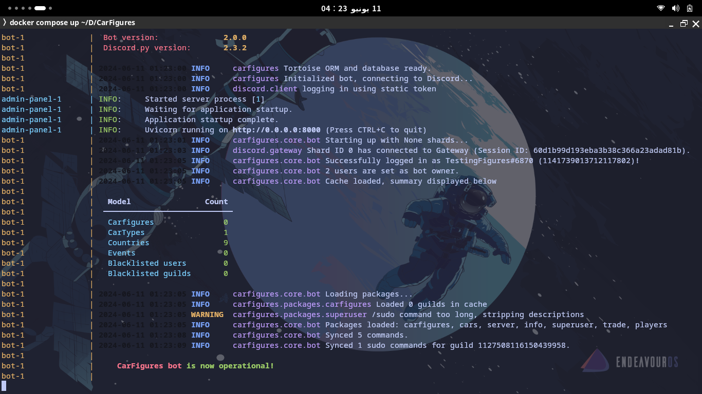

# CarFigures - The Enhanced BallsDex.

## About CarFigures

**CarFigures (CF)** was born out of disagreement with the BallsDex team's decisions. Initially, I had no particular liking for the idea; it was more about a response to dissatisfaction. The BallsDex team wasn't keen on implementing features that many of us wanted. I knew that merely complaining wouldn't lead to any change, as hundreds of others had already done so to no avail.

Determined to make a difference, I decided to take matters into my own hands. By forking BallsDex and applying my own changes and preferences, CarFigures came into existence.

CarFigures aims to address the community's frustrations and provide an alternative base to use and build their bots on. It's a project driven by a desire for improvement and a commitment to providing a better user experience.

## Installation
### Prequirements
Before the Installation, make sure to have the following

- Git | Used for cloning and managing the project repository, and also updating your bot to the latest versions too. | [https://git-scm.com/downloads](https://git-scm.com/downloads) 
- Docker Desktop (1*) | Provides an easy way to run your bot in isolated containers. | [https://www.docker.com/products/docker-desktop](https://www.docker.com/products/docker-desktop) 
- Discord bot Instance | Required to create and manage your bot on Discord. | [https://discord.com/developers/applications](https://discord.com/developers/applications)

> 1* - if u are using linux as ur main desktop (like me) or hosting the bot on a linux server, its generally better to use [Docker Engine](https://docs.docker.com/engine/install/)

### Installting
now since all this is done, let's start!

1. Create a codeberg account if u didn't already
2. Fork this repository [from here](https://codeberg.org/array_ye/CarFigures/fork) or Go to the repo and click "Fork" (1*) 
3. git clone the your using git like this. 
4. Download the settings.toml file [from here](https://drive.usercontent.google.com/download?id=1ZMm3zRS__UC7QOzGGN4ZyxmjnhLbp1sl&export=download&authuser=0) and drag it to ur bot folder, now ur bot folder should look something like this (2*) 
5. Change the Folder name from "CarFigures" to the name of ur dex/figures bot to make it easier for u in docker to know which is what (very useful if working with multiple dexes/figures bots)

> 1* - that this will make u responsible for maintaining your own fork of CF, if u are not interested in that and just want to make a bot, then just git clone the carfigures repo, as u can see it in the third step.\
> 2* - The settings.toml isn't updated by default when updating the bot files, u are required to check if any changes happened to the toml file by yourself, i will update the link of download everytime a new update for it gets released, its your responsibility.
 
## Post-Installation

Once you've completed the installation and configuration steps, its time to configure and make the bot look the way u like it to be!

### Configuration file
remember the settings.toml we just downloaded? yep, that's the configuration file!\

in it u will find allot of stuff to change, that's part of CF's philosophy to make customizing your instance as easy as possible, for now its not much, but we are planning for more soon! :3\
read the comments i left in there to help u out!

### Starting up
after configuring and editing the settings.toml file, now its time to start the bot instance and play with it!

start by getting docker desktop up and running, then open ur file explorer and head to the bot files, i will use my testingfigures bot (the bot i use to test and make commits to CF Repo) to demonstrate 

#### for windows users
to access the command prompt pointed to this bot folder, go to the navigation bar and edit it (u can do that by click the empty part once) to type `cmd` then press enter, this will open a new command prompt instance that is pointed to the bot place

#### for macos/linux users
just cd to the place mate lmao, open a terminal and cd to the folder, if ur bot folder is in the documents folder, usually u do `cd ~/Documents/(your bot folder name)`

after opening the terminal or command prompt, u shall be greeted with something like this (don't mind the toml thing, its git stuff)

now its time for u to build the project image (the image the contains ur database which stores all ur bot's progress, the code and more) using `docker compose build`

and now, its time to start up your bot!\
using `docker compose up` will make the docker starts all the containers and functions to start making connections to the discord's apis, allowing the bot to be alive!
and after doing it, the final results should be like this, with the end line saying "(your bot name) is now operational!"

That's it! You're all set to rock and roll with CarFigures!\
If you run into any trouble along the way, don't hesitate to reach out for help. We're here to make sure you have a smooth ride.

## Contributing to CarFigures!

Here's how you can jump in and help make this project even better:

### How to Contribute

1. Fork the repository to your Codeberg account.
2. Create a new branch for your feature or bug fix: `git checkout -b new-feature`
3. Make your changes and commit them with cool and descriptive messages: `git commit -m 'Add new feature'`
4. Push your changes to your branch: `git push origin new-feature`
5. Open a pull request (PR) against the `stable` branch of the original repository.

### Pull Request (PR) Guidelines

To make sure your PR can be checked out and merged smoothly, please follow these guidelines:

- Clearly describe the purpose of the PR and the changes made, this will make it easy for me to judge the PR, usually i don't refuse them but more clarity = faster response
- Provide tests and documentation for any new features or changes in functionality, this is a good practice too to always debug your code before pushing them.
- If possible, include screenshots showing before/after states of any visual changes, can make it easier for me to review stuff, but i like reading changes too so no worries from this part.
- Ensure that all existing tests pass without failure, i think i don't need to explain this.
- Make sure your code follows the project's coding standards and vibes, because off-vibe code makes it weird for me to look at, and i end up making it look like the rest of the codebase, so pls save me some time lmao.
- Go with the least amount of line changes and commits as possible, this will be easier to track and validate, which allows me to review it fast and give small comments if necessary.

### Code of Conduct

We're all about creating a welcoming and chill community.
Everyone who contributes is expected to stick to the [Code of Conduct](./assets/CODE_OF_CONDUCT.md) when getting involved with the project and its community members.

### Help and Feedback

If you need help, have questions, or want to share your thoughts, don't hesitate to open an issue or ask about it in the dev category inside the CarFigures Discord server. (1*)\
I'm here to support you every step of the way.

I'm stoked about every contribution from the community. Let's join forces and make CarFigures even more rad!\

thanks for everyone who spent the time to even bother to contribute, from providing code to giving suggestions to pointing out bugs, or even emotionally supporting me, all of these are very appreciated, makes me feel like i'm not the only person working on this project and makes me feel like i actually have people to back me up when i need them, so thank you all from the deepest point of my heart ❤️ (especially you, peri :] ❤️)

> 1* - you will need a forker role inside the server to have access to the dev category, so inform me first that u actually making a bot using CF and i will give u the role

## Roadmap and Future Plans
We're excited about the future of CarFigures and all its forks! Here are some features and improvements we have planned:

### Upcoming Features

- Economy and Modifying Packages.
- Server/Player Settings Embed
- Leaderboard Embed + Controls
- Crafting Commands | Customizable Through The Admin Panel
- Racing/Battling Package

### Future Plans

- Switch from fastapi_admin to our own tech-stack.
- Implement a premium plan inside CF.
- Combine some existing commands into one (e.g., /user privacy and /user donation policy into /user settings)