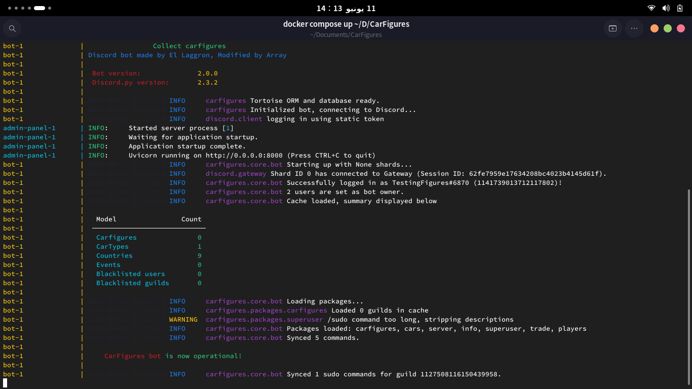

# CarFigures - The Better Alternative.
**CarFigures (The CF Project)** is a fork of the popular bot BallsDex that aims to provide a much better developer/user experience.


[](https://github.com/arrayunderscore/)
[](https://python.org)
[](https://github.com/arrayunderscore/CarFigures/pulls)
[](https://top.gg/bot/1127506544578277446)
[](https://discord.gg/PVFyN34ykA)

<h2>
     <sub>
          
     </sub>
     Installation
</h2>

### Prerequisites

Before starting the installation, ensure you have the following tools installed:

- Git: Used for cloning the project and updating your bot to the latest versions. [Download Git](https://git-scm.com/downloads)
- Docker Desktop: Provides an easy way to run your bot in isolated containers. [Download Docker Desktop](https://www.docker.com/products/docker-desktop)
- Discord Bot Instance: Required to create and manage your bot on Discord. [Create a Discord Bot](https://discord.com/developers/applications)

> **Note:** If you are using Linux as your main desktop (like me) or hosting the bot on a Linux server, it is generally better to use [Docker Engine](https://docs.docker.com/engine/install).

### Installing
Now since all this is done, let's start!

clone the project using git, and git gives u the ability to clone the project inside a new folder it creates with the name u specify, like:
```bash
    git clone https://github.com/thecfproject/CarFigures showerdex
```

> **Note:** The config.toml isn't updated by default when updating the bot files, you are required to check if any changes happened to the toml file by yourself, it's your responsibility.
 
<h2>
     <sub>
          
     </sub>
     Configuration
</h2>

CarFigures is designed to be highly customizable, allowing you to tailor the bot's behavior and appearance to your liking!
This is part of CF's philosophy to make customizing your instance as easy as possible.

now, time to start making that file,
So in ur Bot files, create a new file called config.toml
Read the comments I left in there to help you out!

```toml
[settings]
botToken = ""
botDescription = "Catch, collect and exchange cars in your server!"
botName = "CarFigures"
prefix = "!"
maxFavorites = 50
defaultEmbedColor = "5865F2"

[spawn-manager]
requiredMessageRange =  [22, 55] # the required number of messages to be sent after the cooldown to spawn
spawnMessages = [
    { message = "A wild carfigure has appeared!", rarity = 10 },
    { message = "A blizzard blows in, and with it comes a carfigure!", rarity = 5 },
    { message = "A drop hsa been spotted, and it has a carfigure inside it!", rarity = 2 }
]
catchBonusRate = [-50, 50]
alreadyCaughtMessage = "I was caught already!"
catchButtonText = "Catch me!"
cooldownTime = 600 # in seconds
minimumMembersRequired = 20

[team]
# This section is meant for administrator commands logging and staff purposes.

# If enabled and the application is under a team, all team members will be considered as owners
teamMembersAreOwners = false

# A list of IDs that must be considered owners in addition to the application/team owner
# Separate IDs with commas (,)
co-owners = [877557616094638112]

# List of guild IDs where the /sudo command should be registered
# and a List of role IDs that have access to the command
# Separate IDs with commas (,)
superGuilds = [1289731116525158463]
superUsers = [1290970226627842079]

# Log channel ID for Admin Commands logging
logChannel = 1319049297341452349


[appearance.interface]
collectibleSingular = "carfigure"
collectiblePlural = "carfigures"
cartype = "CarType"
country = "Country"
exclusive = "Exclusive"
horsepower = "Horsepower"
weight = "Weight"
kg = "KG" # that's kilograms
hp = "HP" # that's horsepower

[appearance.commands.names]
cars = "cars"
sudo = "sudo"
garage = "garage"
exhibit = "exhibit"
show = "show"
info = "info"
last = "last"
gift = "gift"

[appearance.commands.descs]
garage = "Show Your garage!"
exhibit = "Show your showroom in the bot."
show = "Display info from your carfigures collection."
info = "Display info for a specific carfigure."
last = "Display info of your or another user's last caught carfigure."
gift = "Give a carfigure to a user."

[information]
## This section is also one of bot's main factures that provides information about the bot which can help others to find more information about the bot.

repositoryLink = "https://github.com/The-CF-Project/CarFigures"
serverInvite = "https://discord.com/invite/PVFyN34ykA"
termsOfService = "https://codeberg.org/array_ye/CarFigures/src/branch/stable/assets/TERMS_OF_SERVICE.md"
privacyPolicy = "https://codeberg.org/array_ye/CarFigures/src/branch/stable/assets/PRIVACY_POLICY.md"

# While this is made to make it easier to include yourself and your team/contributors
# you are NOT allowed to remove El Laggron or Array_YE.
# Separate names with commas (,)
developers = [
    "El Laggron",
    "Array_YE",
]
contributors = [
    "Queen_the_darkner",
    "HiboMan",
    "KingOfTheHill4965",
    "DistinguishedAxolotl"
]

[prometheus] # if u don't know what this do, don't touch it.
enabled = false
host = "0.0.0.0"
port = 15260
```

<h2>
     <sub>
          
     </sub>
     Booting
</h2>
After configuring and editing the config.toml file, it's time to start the bot instance and play with it!

Start by getting docker desktop/engine up and running, then open your file explorer and head to the bot files.

> **Note**: this part assumes that u have the windows terminal installed if u are on windows.

if u are using windows,just right click the project folder and select (Open in Terminal).
if u use a Unix-like system (macos, linux) You should just cd to the place, open a terminal and cd to the folder.

now its time for you to build the project image (the image of the containers like the database and bot's code/panel) using `docker compose build`.

And now, Using `docker compose up` will make the docker start all the containers!
And after doing it, the final results should be like this, with the end line saying "(your bot name) is now operational!"
which means, your bot is now running with no issues!


If you need help, have questions, or want to share your thoughts, don't hesitate to reach out!
u can open an issue or ask about it in the dev category inside the discord server.

<h2>
     <sub>
          
     </sub>
     Contributing
</h2>

Here's how you can jump in and help make this project even better:

### How to Contribute
There are several ways you can contribute to the CarFigures project:

1. **Open Issues:** Found a bug or have a feature request? Open an issue to let us know. This helps us identify and fix problems or consider new features.
2. **Help with Documentation:** Improve the documentation to make it easier for others to get started and understand the project. This includes tutorials, guides, and updating the README.
3. **Submit Pull Requests:** Fix bugs, add features, or improve existing code. See below for guidelines on how to submit a pull request.
4. **Provide Feedback:** Test the project and give feedback on your experience. This helps us understand what works well and what needs improvement.
5. **Spread the Word:** Share the project with others who might be interested in using or contributing to it.
6. **Join Discussions:** Participate in discussions on GitHub issues or the Discord server to help shape the future direction of the project.

<details>
<summary><strong>Opening Issues</strong></summary>

1. Go to the Issues section of the repository.
2. Click on the "New Issue" button.
3. Provide a clear and descriptive title for the issue.
4. Include detailed information in the body, such as steps to reproduce the bug or a detailed description of the feature request.
</details>

<details>
<summary><strong>Helping with Documentation</strong></summary>
 
1. Fork the repository to your GitHub account.
2. Create a new branch for your documentation changes: git checkout -b improve-docs
3. Make your changes and commit them with descriptive messages: git commit -m 'Improve documentation for installation process'
4. Push your changes to your branch: git push origin improve-docs
Open a pull request (PR) against the stable branch of the original repository.
</details>

<details>
<summary><strong>Submitting Features/Bug Fixes</strong></summary>

1. Fork the repository to your GitHub account.
2. Create a new branch for your feature or bug fix: git checkout -b new-feature
3. Make your changes and commit them with descriptive messages: git commit -m 'Add new feature'
4. Push your changes to your branch: git push origin new-feature
Open a pull request (PR) against the upstream branch of the original repository.
</details>

<h2>
     <sub>
          
     </sub>
     Roadmap
</h2>

I'm excited about the future of the project and all the bots that use it!

### Future Plans

- Switching From TortoiseORM/Fastapi to PrismaORM/In-House Panel!
- Migrating the base from Python to TypeScript!
- Have accessiblity Feature! e.g. Internationalization

<h2>
     <sub>
          
     </sub>
     Final Thoughts
</h2>

I am incredibly grateful to everyone who contributes to The CF Project. Whether you provide code, suggest features, report bugs, or offer emotional support, your efforts are deeply appreciated. Knowing I am not alone in this project and having a supportive community means the world to me.

Thank you all from the bottom of my heart ❤️ 

Let's continue making this project an awesome and valuable project for everyone!

